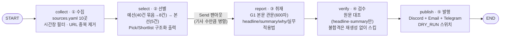

# REPORT — 나만의 뉴스레터 에이전트

저장소: https://github.com/inseoklee-ai/my-newsletter

## 1. 분야 및 독자 정의

**분야**: AI 전반 — LLM/AI Agent의 발전과 진화, AI 보안, 양자컴퓨터, AI를 둘러싼
사회·경제·정치 이슈, 국내 대기업·중소기업의 AI 도입 동향. 한 가지 좁은 주제가 아니라
"AI를 공부하는 사람이 매일 훑어야 할 다섯 갈래"를 의도적으로 묶었다.

**독자 페르소나**: 함께 공부하는 AI 개발자 스터디원들 — LLM API 사용법과 기본적인
Agent 개념은 이미 아는 실무 지향 개발자. "논문을 요약해 달라"가 아니라 "이게 우리
스터디/실무에 어떻게 연결되는가"를 원하는 독자로 설정했다.

이 정의는 `audience.yaml`에 그대로 코드화되어 있다.

## 2. 소스 채택표

강의에서 배운 3관문(G1 본문 · G2 생존 · G3 접근)을 실측해 채택/탈락을 정했다.
"그럴듯해 보이는 곳"이 아니라 숫자로 판단한 근거다.

| 소스 | G1(본문) | G2(생존) | G3(접근) | 판정 | 비고 |
|---|---|---|---|---|---|
| 전자신문 AI | 3/3 통과 | 1h 전 | 200 | ✅ 채택 | 처음엔 `Section901.xml`(전체 뉴스)로 잘못 넣어 뒀다가, AI 전용 섹션(`04046.xml`)으로 바로잡음 |
| 전자신문 보안 | 3/3 통과 | 2h 전 | 200 | ✅ 채택 | |
| ZDNet Korea | (RSS 요약 자체 1001자) | 0.5h 전 | 200 | ✅ 채택 | AI 전용 피드는 못 찾아 전체 피드 사용 — 관련 없는 건 `select`가 걸러냄 |
| 보안뉴스 | 3/3 통과 | 최신 (발행시각 표기가 KST를 UTC로 잘못 해석하는 관행 있음) | 200 | ✅ 채택 | |
| arXiv cs.CL | 초록 자체 1421자(충분) | 23h(일일 갱신이라 정상) | 200 | ✅ 채택 | LLM 연구 |
| arXiv cs.CR | 초록 1896자 | 23h | 200 | ✅ 채택 | 보안 연구 |
| arXiv quant-ph | 초록 696자 | 23h | 200 | ✅ 채택 | 양자컴퓨터 연구 |
| Ars Technica AI | 3/3 통과 | 6h 전 | 200 | ✅ 채택 | 해외 산업·사회 이슈 |
| Quantum Zeitgeist | 3/3 통과 | 16h 전 | 200 | ✅ 채택 | 양자컴퓨터 전문 매체 |
| The Quantum Insider | 3/3 통과 | 11h 전 | 200 | ✅ 채택 | 양자컴퓨터 전문 매체 |
| 전자신문 중기/벤처 | — | **82일 전 (G2 탈락)** | 200 | 🚫 탈락 | 섹션 자체가 뜸하게 갱신됨 |
| VentureBeat AI | — | **18.5일 전 (G2 탈락)** | 200 | 🚫 탈락 | |
| TechCrunch AI | 3/3 통과(성능은 정상) | 1h 전 | 200 | 🚫 탈락 | **과제 제외 목록에 포함된 소스라 채택 불가** |
| BleepingComputer | — | — | **403 (G3 탈락)** | 🚫 탈락 | 크롤링 차단 |
| Dark Reading | **0/3 (G1 탈락)** | 6h 전 | 200 | 🚫 탈락 | RSS 요약은 있지만 원문 추출이 전부 600자 미만(유료화/봇 차단 추정) |

**최종 채택 10곳**, 5곳 탈락. 다섯 갈래 관심사(LLM연구·보안연구·양자컴퓨터·국내산업·해외산업)를 모두 커버한다.

## 3. 선별 로직 설계

**중요도 판단 문장** (`audience.yaml`):
- LLM/AI Agent 기술이 실질적으로 진화했다고 볼 근거가 있는가
- AI 보안 또는 양자컴퓨터 관련 새로운 위협/기술적 진전이 있는가
- 국내 대기업·중소기업의 AI 도입 사례나 정책 변화가 실제로 있었는가
- AI를 둘러싼 사회·경제·정치적 이슈로 스터디원들의 관점을 넓힐 만한가
- (버릴 것) 발표 예정·로드맵만 있는 것 / MOU·투자유치·수상 등 홍보성 소식 / 맥락 없는 단순 주가·시황

**2단계 구조(예선 → 본선)와 묶음 크기**: 소스 10곳(그중 arXiv 3곳만으로 하루 250건 이상)을
합치면 하루 700~800건이 모인다. 한 프롬프트에 다 넣을 수 없어 예선에서 나눠 거르고,
살아남은 것만 본선에서 한 화면에 놓고 비교한다.

- **묶음 크기 40, 묶음당 8건 통과**: 강의에서 실측으로 정한 값을 그대로 채택했다.
  더 잘게 쪼개면(20건) 예선 호출이 배로 늘고, 더 크게 묶으면(60건) "중간을 흘리는" 문제가
  커진다는 트레이드오프를 이해하고, 검증된 값을 재사용하는 쪽을 택했다.
- 실측 결과 매 실행마다 대략 **700~800건 → 예선 150~165건 → 본선 5건**으로 좁혀졌다.
  LLM 호출은 예선(약 20묶음) + 본선(1회) = 20여 회 — 후보 전체를 독립 채점했다면
  700회가 넘었을 것과 비교된다.
- 선별은 구조화 출력(`Pick`/`Shortlist` 스키마)으로 받아 `event` 라벨(같은 사건이면 같은 라벨)까지
  함께 받는다.

## 4. 파이프라인 구조도



**State(`Brief`) 흐름**: `collected`(①) → `picked`(②) → `drafted`(③, `operator.add`로 병렬
결과 누적) → `verified`(④) → `channels`/`log`(⑤). `channels`와 `log`만 여러 노드가
동시에 쓰는 자리라 리듀서가 붙어 있고, 나머지는 한 노드가 쓰고 다음이 읽는 값이라
덮어쓰기다.

## 5. 실행 기록

GitHub Actions에서 실제로 발행 성공한 실행: https://github.com/inseoklee-ai/my-newsletter/actions/runs/34936811722

```
① 수집   24시간 창 · 795건
② 선별   795 → 예선 160 → 5건
④ 검수   5 → 5건
⑤ 발행   5건 · Discord sent · Email sent · Telegram sent
```

`store/metrics.jsonl`에 남은 해당 실행 기록:

```json
{"run_id": "2026-09-15 15:26", "collected": 795, "picked": 5, "drafted": 5, "published": 5,
 "hours": 24, "channels": {"discord": "sent", "email": "sent", "telegram": "sent"},
 "by_source": {"arXiv cs.CL": 2, "전자신문 AI": 2, "arXiv cs.CR": 1}}
```

이 실행으로 Discord(`#뉴스레터-에이전트`), 이메일 3명, 텔레그램 개인 채팅에 실제로
브리핑이 도착한 것을 직접 확인했다. *(제출 시 각 채널에 도착한 화면 캡처를 이 아래에
붙여 넣을 것.)*


## 6. 프로젝트 회고

**가장 공들인 부분**
- 소스를 "그럴듯해서"가 아니라 G1/G2/G3 실측으로 골랐다는 것 — 특히 전자신문 AI 섹션은
  처음에 URL을 잘못 넣었는데("전체 뉴스"를 AI 섹션으로 착각), 재측정 과정에서 스스로 걸러졌다.
- 발행 채널을 Discord 하나가 아니라 Discord/이메일/텔레그램 세 곳으로 늘리면서, 각 채널의
  실패를 서로 다른 상태값(`sent`/`dry_run`/`skipped`/`failed`)으로 구분해 로그에 남긴 것.
  실제로 이메일 발송이 두 번 실패했는데(인코딩 문제 → 앱 비밀번호에 섞인 특수공백 문제),
  로그가 "실패"와 "dry-run"을 구분해 남겨준 덕분에 원인을 좁혀갈 수 있었다.

**향후 보완하고 싶은 점**
- `select`에서 받는 `event` 라벨(같은 사건 중복 제거용)이 `report`/`publish`까지 이어지지
  않는다 — 강의 때와 같은 한계가 그대로 남아 있어, 본선 단계에서 같은 사건이 여러 자리를
  차지할 위험이 있다.
- `실무적용법` 필드가 기술/연구 기사에서는 구체적이지만, 정치·사회 이슈 기사에서는 일반론에
  가까워지는 경향을 발견했다. `why`/`실무적용법`은 원문과 대조할 수 없는 해석 영역이라 `verify`가
  걸러주지 못하는데, 이 부분을 어떻게 보강할지는 아직 답을 못 찾았다.
- 강의에서 강조한 "조용한 날에도 무언가를 보낸다"는 세 채널 모두에 적용해 뒀지만, "며칠째
  조용하면 그 자체가 이상 신호"라는 관측(예: 3일 연속 0건이면 별도 경고)까지는 아직
  구현하지 않았다.
